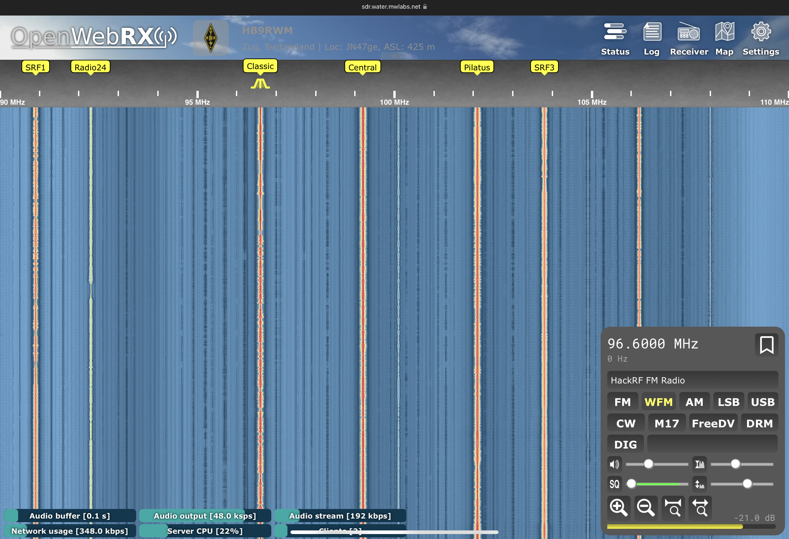
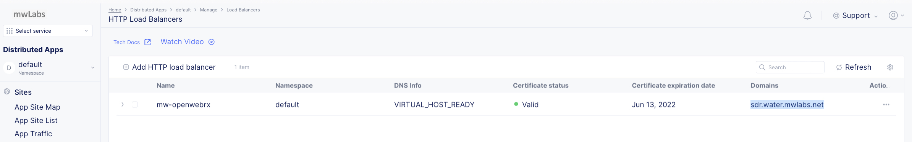

# F5 Distributed Cloud SDR OpenWebRX Demo



## Requirements

- SDR Hardware receiver, e.g. RTL-SDR USB sticks or HackRF One
- [OpenWebRX multi-user SDR receiver](https://www.openwebrx.de)
- Kubernetes cluster with an x86_64 based node with a USB port to connect the SDR receiver
- [F5 Distributed Cloud Service Account](https://f5.com/cloud) (F5XC).
Click 'Sign Up' for a free individual account for Distributed apps in our network or across cloud or edge.
- DNS domain to delegate prefix to F5 Distributed Cloud Service (F5XC)

## Installation

### SDR receiver and OpenWebRX

Attach the SDR receiver to a free high speed USB port of your kubernetes node.

Clone the repo [https://github.com/mwiget/f5-xc-sdr-openwebrx](https://github.com/mwiget/f5-xc-sdr-openwebrx):

```
$ git clone https://github.com/mwiget/f5-xc-sdr-openwebrx
$ cd f5-xc-sdr-openwebrx
```

The manifest [openwebrx.yaml](openwebrx.yaml) deploys the web-based software defined radio receiver from 
[Docker Hub](https://hub.docker.com/r/jketterl/openwebrx) as a privileged pod with the local folder /etc/openwebrx
exposed for the configuration. Please consult the [OpenWebRX documentation](https://github.com/jketterl/openwebrx/wiki) 
on howto get the initial configuration setup, like creating user account and radio profiles. 

Start by creating a namespace for the pod, e.g. 'sdr', then apply the openwebrx manifest:

```
$ kubectl create ns sdr
$ kubectl apply -f openwebrx.yaml -n sdr

deployment.apps/openwebrx created
service/frontend created

$ kubectl get pods -n sdr
NAME                         READY   STATUS    RESTARTS   AGE
openwebrx-869fc4c5fd-vc7ln   1/1     Running   0          5s

$ kubectl get services -n sdr
NAME       TYPE        CLUSTER-IP       EXTERNAL-IP   PORT(S)   AGE
frontend   ClusterIP   10.152.183.174   <none>        80/TCP    17s
```

Optionally log into the pod to check the SDR receiver can be reached and what version it has (shown here
for HackRF One):

```
$ kubectl exec -ti openwebrx-869fc4c5fd-vc7ln -n sdr -- bash

root@openwebrx-869fc4c5fd-vc7ln:/opt/openwebrx# hackrf_info 
hackrf_info version: git-6e5cbda
libhackrf version: git-6e5cbda (0.5)
Found HackRF
Index: 0
Serial number: 000000000000000075b068dc323dae07
Board ID Number: 2 (HackRF One)
Firmware Version: 2021.03.1 (API:1.04)
Part ID Number: 0xa000cb3c 0x0066476b
```

### Register site with F5 Distributed Cloud

Download the [kubernetes site manifest](https://gitlab.com/volterra.io/volterra-ce/-/blob/master/k8s/ce_k8s.yml):

```
$ wget https://gitlab.com/volterra.io/volterra-ce/-/raw/master/k8s/ce_k8s.yml
```

Edit the manifest, search for 'CHANGE ME' and specify ClusterName (will be used as site name), Latitude and Longitude
and Site Token (you can generate and copy one in the F5XC Console, once logged in).

E.g. a filled out template (just showing the parts requiring change) is 

```
    # CHANGE ME
    ClusterName: zug-attic
    ClusterType: ce
    Config: /etc/vpm/config.yaml
    DisableModules: ["dictator", "recruiter"]
    # CHANGE ME
    Latitude: 47.16970
    # CHANGE ME
    Longitude: 8.51445
    MauriceEndpoint: https://register.ves.volterra.io
    MauricePrivateEndpoint: https://register-tls.ves.volterra.io
    PrivateNIC: eth0
    SkipStages: ["osSetup", "etcd", "kubelet", "master", "voucher", "workload", "controlWorkload"]
    # CHANGE ME
    Token: 25730e8f-88a0-41c4-af5f-07854bff8cb9
```

The kubernetes node must have at least 400 2M hugepages configured and available.

Apply the k8s manifest

```
$ kubectl apply -f ce_k8s.yml
```

Check the pod in namespace ves-system is running:

```
$ kubectl get pods -n ves-system
NAME                     READY   STATUS    RESTARTS       AGE
volterra-ce-init-c2pq4   1/1     Running   0              7m46s
vp-manager-0             1/1     Running   1 (5m7s ago)   7m23s
etcd-7d86fd7dc7-m92z2    2/2     Running   0              4m50s
ver-0                    16/16   Running   0              4m33s
```

Now log into the [F5 Distributed Cloud Console](https://f5.com/cloud), go to 'Site Management', 'Registrations'
and accept the registration request from our new site.

After a few minutes, the site will be online and listed under 'Site List'.

### Create Origin Pool and HTTP Load Balancer

We will use Terraform to create the origin pool, health check and HTTP load balancer with websocket support and
automated certificate for TLS. Create an API certificate in the F5XC Console by

- Log into your [F5 Distributed CLoud Console](https://f5.com/cloud)
- Click on the account symbol in the upper right corner, then select 'Account Settings'
- Under 'Personal Management', click on 'Credentials', then 'Create Credentials'
- Pick an name and password (will be used to set env variable VES_P12_PASSWORD) and an expiration date
- Click 'Download' to download the ves.volterra.io.api-creds.p12 file

Copy now the terraform.tfvars.example template to terraform.tfvars and edit the file.

```
$ cp terraform.tfvars.example terraform.tfvars
$ cat terraform.tfvars

projectPrefix = "mw"
siteName = "zug-attic"
fqdn = "sdr.water.mwlabs.net"
serviceName = "frontend.sdr"

volterraUrl = "https://console.ves.volterra.io/api"
volterraP12 = "/home/mwiget/f5-xc-sdr-openwebrx/ves.volterra.io.api-creds.p12"
```

The projectPrefix will be used for object names. The siteName must match the kubernetes site registered
earlier. The chosen fqdn is the fully qualified DNS domain that is a sub domain of the delegated domain to
F5 Distributed Cloud. See [domain delegation documentation](https://docs.cloud.f5.com/docs/how-to/app-networking/domain-delegation)
for details.

E.g. in this example, water.mwlabs.net has been delegated to F5XC and the chosen sub domain is 'sdr'. This will allow
users to reach the webradio via [https://sdr.water.mwlabs.net](https://sdr.water.mwlabs.net).

The volterraP12 must point to the download api credentials p12 file.

Set the environment variable 'VES_P12_PASSWORD' to the password set when creating the api credentials via UI:

```
$ export VES_P12_PASSWORD='blablabla'
```

Initialize terraform and apply it:

```
$ terraform init
$ terraform apply
```

That's it! Check the created object in [F5 Distributed Cloud Console](https://f5.com/cloud) under 'Distributed Apps', 
'Manage', 'Load Balancers', 'HTTP Load Balancers':



Time to test! Open [https://sdr.water.mwlabs.net](https://sdr.water.mwlabs.net)


